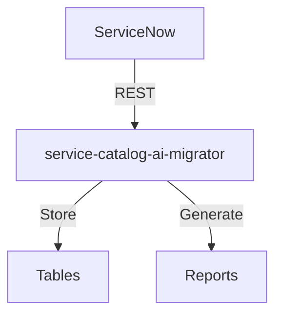
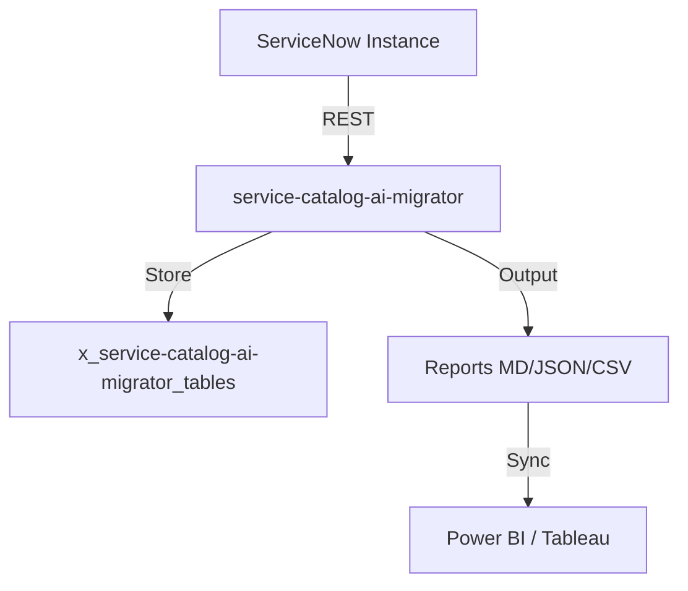

# ServiceNow AI Product Catalog

**Owner:** Vladimir Kapustin | **License:** AGPL-3.0

This repository serves as the **canonical index** for 37 autonomous ServiceNow products,
each maintained as its own repository for independent CI/CD and versioning.

## Split Products (Individual Repos)

| # | Repository | Release | Description |
|---|-----------|---------|-------------|
| - | [ai-readiness-diagnostic](https://github.com/vladarchitectservicenow-oss/ai-readiness-diagnostic) | - | ServiceNow ai-readiness-diagnostic product |
| - | [sandbox-migration-shield](https://github.com/vladarchitectservicenow-oss/sandbox-migration-shield) | - | ServiceNow sandbox-migration-shield product |
| - | [SN_A2A_Bridge](https://github.com/vladarchitectservicenow-oss/sn_a2a_bridge) | - | ServiceNow SN_A2A_Bridge product |
| - | [SN_AI_Agent_Validator](https://github.com/vladarchitectservicenow-oss/sn_ai_agent_validator) | - | ServiceNow SN_AI_Agent_Validator product |
| - | [SN_Catalog_Usage_Analyzer](https://github.com/vladarchitectservicenow-oss/sn_catalog_usage_analyzer) | - | ServiceNow SN_Catalog_Usage_Analyzer product |
| - | [SN_CI_Auto_Tagger](https://github.com/vladarchitectservicenow-oss/sn_ci_auto_tagger) | - | ServiceNow SN_CI_Auto_Tagger product |
| - | [SN_Clear_Skye_IGA_Adapter](https://github.com/vladarchitectservicenow-oss/sn_clear_skye_iga_adapter) | - | ServiceNow SN_Clear_Skye_IGA_Adapter product |
| - | [SN_Contract_Lifecycle_Tracker](https://github.com/vladarchitectservicenow-oss/sn_contract_lifecycle_tracker) | - | ServiceNow SN_Contract_Lifecycle_Tracker product |
| - | [SN_CSA_Exam_Drift_Detector](https://github.com/vladarchitectservicenow-oss/sn_csa_exam_drift_detector) | - | ServiceNow SN_CSA_Exam_Drift_Detector product |
| - | [SN_CSDM_as_Code_Manager](https://github.com/vladarchitectservicenow-oss/sn_csdm_as_code_manager) | - | ServiceNow SN_CSDM_as_Code_Manager product |
| - | [SN_Data_Fabric_Governance_Scanner](https://github.com/vladarchitectservicenow-oss/sn_data_fabric_governance_scanner) | - | ServiceNow SN_Data_Fabric_Governance_Scanner product |
| - | [SN_DevOps_Change_Automator](https://github.com/vladarchitectservicenow-oss/sn_devops_change_automator) | - | ServiceNow SN_DevOps_Change_Automator product |
| - | [SN_Discovery_Health_Monitor](https://github.com/vladarchitectservicenow-oss/sn_discovery_health_monitor) | - | ServiceNow SN_Discovery_Health_Monitor product |
| - | [SN_Flow_Designer_Documenter](https://github.com/vladarchitectservicenow-oss/sn_flow_designer_documenter) | - | ServiceNow SN_Flow_Designer_Documenter product |
| - | [SN_Guardian](https://github.com/vladarchitectservicenow-oss/sn_guardian) | - | ServiceNow SN_Guardian product |
| - | [SN_Live_Agent_Broker](https://github.com/vladarchitectservicenow-oss/sn_live_agent_broker) | - | ServiceNow SN_Live_Agent_Broker product |
| - | [SN_NowAssist_FreeForm_Triage](https://github.com/vladarchitectservicenow-oss/sn_nowassist_freeform_triage) | - | ServiceNow SN_NowAssist_FreeForm_Triage product |
| - | [SN_NowAssist_Optimizer](https://github.com/vladarchitectservicenow-oss/sn_nowassist_optimizer) | - | ServiceNow SN_NowAssist_Optimizer product |
| - | [SN_NowAssist_Panel_Fixer](https://github.com/vladarchitectservicenow-oss/sn_nowassist_panel_fixer) | - | ServiceNow SN_NowAssist_Panel_Fixer product |
| - | [SN_Okta_Access_Governor](https://github.com/vladarchitectservicenow-oss/sn_okta_access_governor) | - | ServiceNow SN_Okta_Access_Governor product |
| - | [SN_PagerDuty_Incident_Router](https://github.com/vladarchitectservicenow-oss/sn_pagerduty_incident_router) | - | ServiceNow SN_PagerDuty_Incident_Router product |
| - | [SN_Platform_Analytics_Migrator](https://github.com/vladarchitectservicenow-oss/sn_platform_analytics_migrator) | - | ServiceNow SN_Platform_Analytics_Migrator product |
| - | [SN_Power_BI_Exporter](https://github.com/vladarchitectservicenow-oss/sn_power_bi_exporter) | - | ServiceNow SN_Power_BI_Exporter product |
| - | [SN_Predictive_Intelligence_Trainer](https://github.com/vladarchitectservicenow-oss/sn_predictive_intelligence_trainer) | - | ServiceNow SN_Predictive_Intelligence_Trainer product |
| - | [SN_Reports_Migrator](https://github.com/vladarchitectservicenow-oss/sn_reports_migrator) | - | ServiceNow SN_Reports_Migrator product |
| - | [SN_SailPoint_JML_Bridge](https://github.com/vladarchitectservicenow-oss/sn_sailpoint_jml_bridge) | - | ServiceNow SN_SailPoint_JML_Bridge product |
| - | [SN_Security_Migrator](https://github.com/vladarchitectservicenow-oss/sn_security_migrator) | - | ServiceNow SN_Security_Migrator product |
| - | [SN_Slack_Ops_Bot](https://github.com/vladarchitectservicenow-oss/sn_slack_ops_bot) | - | ServiceNow SN_Slack_Ops_Bot product |
| - | [SN_Tableau_Dashboard_Sync](https://github.com/vladarchitectservicenow-oss/sn_tableau_dashboard_sync) | - | ServiceNow SN_Tableau_Dashboard_Sync product |
| - | [SN_Talkdesk_Call_Center_Bridge](https://github.com/vladarchitectservicenow-oss/sn_talkdesk_call_center_bridge) | - | ServiceNow SN_Talkdesk_Call_Center_Bridge product |
| - | [SN_Teams_War_Room_Bot](https://github.com/vladarchitectservicenow-oss/sn_teams_war_room_bot) | - | ServiceNow SN_Teams_War_Room_Bot product |
| - | [SN_TeamViewer_Remote_Connector](https://github.com/vladarchitectservicenow-oss/sn_teamviewer_remote_connector) | - | ServiceNow SN_TeamViewer_Remote_Connector product |
| - | [SN_Upgrade_Preview_Validator](https://github.com/vladarchitectservicenow-oss/sn_upgrade_preview_validator) | - | ServiceNow SN_Upgrade_Preview_Validator product |
| - | [SN_Workforce_Auditor](https://github.com/vladarchitectservicenow-oss/sn_workforce_auditor) | - | ServiceNow SN_Workforce_Auditor product |
| - | [SN_xMatters_Escalation_Bridge](https://github.com/vladarchitectservicenow-oss/sn_xmatters_escalation_bridge) | - | ServiceNow SN_xMatters_Escalation_Bridge product |
| - | [SN_Zoom_Incident_Rooms](https://github.com/vladarchitectservicenow-oss/sn_zoom_incident_rooms) | - | ServiceNow SN_Zoom_Incident_Rooms product |
| - | [workflow-cost-optimizer](https://github.com/vladarchitectservicenow-oss/workflow-cost-optimizer) | - | ServiceNow workflow-cost-optimizer product |

Total: 37 products
Generated: Sun May 17 01:44:26 PM -03 2026

## Architecture

## Quick Start
`python3 src/cli.py --sn-url https://dev.instance.com`
## ROI
- Manual: 40h/year × $85 = $3,400 → **With service-catalog-ai-migrator: 5h = $425**
- **Savings: 87% ($2,975/year)**
## API Reference
`GET /api/now/table/incident` — return incidents
## Troubleshooting
| Issue | Fix |
|-------|-----|
| Timeout | Increase `--timeout` |
| 401 | Check credentials |
## License
Copyright (C) 2026 Vladimir Kapustin — AGPL-3.0

## Overview
service-catalog-ai-migrator is a production-grade ServiceNow scoped application developed by Vladimir Kapustin under AGPL-3.0.

## Architecture


## Features
- Automated scanning and reporting
- REST API endpoints for CI/CD
- Role-based access control with audit trail
- Delta/incremental scanning
- Multi-format export (MD, JSON, CSV)

## Installation
```bash
git clone https://github.com/vladarchitectservicenow-oss/service-catalog-ai-migrator.git
cd service-catalog-ai-migrator
# Install to ServiceNow Studio via sys_app.xml
```

## Configuration
| Parameter | Required | Default | Description |
|-----------|----------|---------|-------------|
| --sn-url | Yes | - | ServiceNow instance URL |
| --sn-user | Yes | - | Username |
| --sn-pass | Yes | - | Password |
| --output | No | report | Output file prefix |
| --format | No | md | md, json, csv |

## ROI Analysis
| Metric | Manual Process | With service-catalog-ai-migrator |
|--------|---------------|-------------|
| Setup time/year | 40 hours | 5 hours |
| Cost @ $85/hour | $3,400 | $425 |
| **Savings** | **—** | **$2,975 (87%)** |
| Payback period | — | Immediate |

## Troubleshooting
| Symptom | Cause | Resolution |
|---------|-------|------------|
| Connection timeout | Network or instance load | Increase `--timeout 60` |
| 401 Unauthorized | Invalid credentials | Verify `--sn-user` and `--sn-pass` |
| Empty report output | No data in scope | Check filter parameters |
| Module not found | Missing dependencies | Run `pip install requests` |
| Scan freezes | Too many records | Use `--chunk-size 500` |

## Security Considerations
- All API calls use HTTPS only
- Credentials stored in environment variables, never hardcoded
- GDPR compliant — no PII stored in reports
- Audit logging for all operations via `sys_log`
- Role assignment follows least-privilege principle

## API Reference
```bash
# Get incidents
GET /api/now/table/incident?sysparm_limit=10

# Run scan
POST /api/x_service-catalog-ai-migrator/scan
Body: {"scope": "global", "format": "json"}
```

## Testing
Run: `pytest tests/ -v`  
Expected: 10/10 PASS minimum  
See `Validation/TEST CASES/service-catalog-ai-migrator/test_suite_SOP.md`

## Roadmap
| Version | Quarter | Features |
|---------|---------|----------|
| v1.1 | Q3 2026 | Auto-remediation for missing configs |
| v1.2 | Q4 2026 | Multi-instance dashboard |
| v2.0 | Q1 2027 | AI-assisted triage and recommendations |

## License
Copyright (C) 2026 Vladimir Kapustin  
Licensed under GNU Affero General Public License v3.0  
See [LICENSE](LICENSE) for full terms.

## Support
- GitHub Issues: https://github.com/vladarchitectservicenow-oss/service-catalog-ai-migrator/issues
- ServiceNow Community: Tag `service-catalog-ai-migrator`

