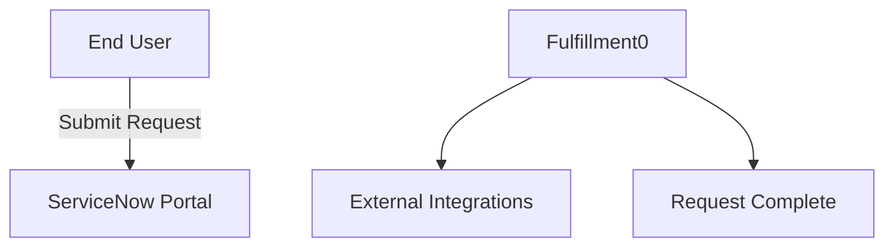
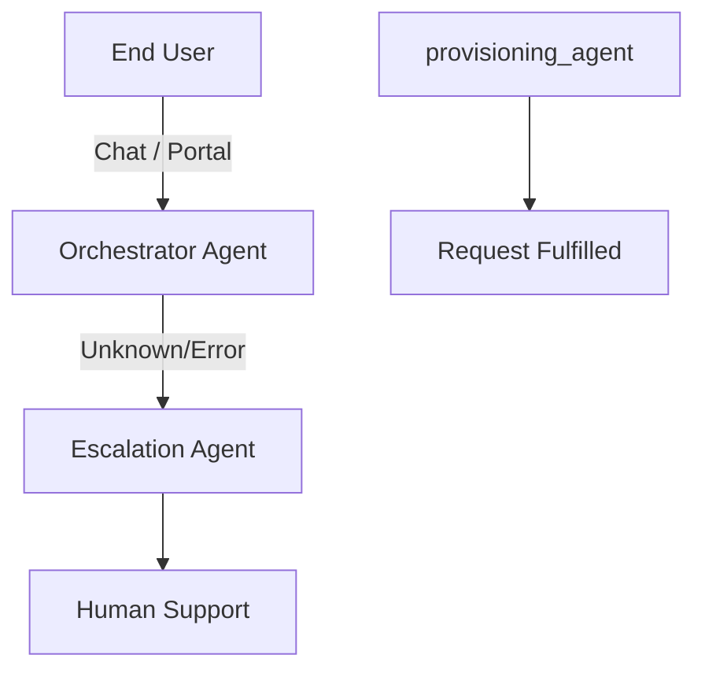

# Technical Specification

## 1. Introduction

This document defines the technical architecture for migrating the ServiceNow service catalog
at **https://dev362840.service-now.com** to an AI-agent-driven system.

## 2. Current Architecture

### 2.1 Workflow Overview

### 2.2 Catalog Item Summary

| Item | Category | Active | Requests | Approval Required |
|------|----------|--------|----------|-------------------|

| Manage Knowledge Ownership Group | N/A | Yes | 0 | No |

| Retire a Standard Change Template | 00728916937002002dcef157b67ffb6d | Yes | 0 | No |

| Grant role delegation rights within a group | 496a3a7e0a0a0bc00089b39df14eb56e | Yes | 0 | No |

| Request email alias | 22555319db0150104327198d1396195c | Yes | 0 | No |

| Access | 2809952237b1300054b6a3549dbe5dd4 | Yes | 0 | No |

| Cisco jabber softphone | 109cdff8c6112276003b17991a09ad65 | Yes | 0 | No |

| Standard Laptop | d258b953c611227a0146101fb1be7c31 | Yes | 0 | No |

| Pixel 4a | d68eb4d637b1300054b6a3549dbe5db2 | Yes | 0 | No |

| Adobe Acrobat Pro | 2809952237b1300054b6a3549dbe5dd4 | Yes | 0 | No |

| Finishing Services | 109f0438c6112276003ae8ac13e7009d | Yes | 0 | No |

| Document Creation | 109f0438c6112276003ae8ac13e7009d | Yes | 0 | No |

| Paper and Supplies | 109cdff8c6112276003b17991a09ad65 | Yes | 0 | No |

| Conference Room Reservations | d25201c8c611227a00667da13c6d33af | Yes | 0 | No |

| Packaging and Shipping | 109cdff8c6112276003b17991a09ad65 | Yes | 0 | No |

| Cubicle Modifications | d2f716fcc611227a015a142fa0b262c1 | Yes | 0 | No |

| Request for Backup | 109f0438c6112276003ae8ac13e7009d | Yes | 0 | No |

| Office Keys | d2f7cae4c611227a018ddc481b34e099 | Yes | 0 | No |

| Request Security Escort | d2f7cae4c611227a018ddc481b34e099 | Yes | 0 | No |

| Install Software | 109f0438c6112276003ae8ac13e7009d | Yes | 0 | No |

| Loaner Laptop | d258b953c611227a0146101fb1be7c31 | Yes | 0 | No |

| Register a Business Application | 31bbeaf8e4001410f877ce457cda6be2 | Yes | 0 | No |

| Sketch | 2809952237b1300054b6a3549dbe5dd4 | Yes | 0 | No |

| 3M Privacy Filter - MacBook Pro | 2c0b59874f7b4200086eeed18110c71f | Yes | 0 | No |

| New Email Account | c3d3e02b0a0a0b12005063c7b2fa4f93 | Yes | 0 | No |

| Table Index | 109f0438c6112276003ae8ac13e7009d | Yes | 0 | No |

| Delegate roles to group member | 496a3a7e0a0a0bc00089b39df14eb56e | Yes | 0 | No |

| Standard 24" Monitor | 2c0b59874f7b4200086eeed18110c71f | Yes | 0 | No |

| Request Developer Project Equipment | N/A | Yes | 0 | No |

| Galaxy Note 20 | d68eb4d637b1300054b6a3549dbe5db2 | Yes | 0 | No |

| Password Reset | e15706fc0a0a0aa7007fc21e1ab70c2f | Yes | 0 | No |

| Apple MacBook Pro 15" | d258b953c611227a0146101fb1be7c31 | Yes | 0 | No |

| Catalog Client Script | N/A | Yes | 0 | No |

| Service Fulfillment Steps - Custom approval step | N/A | Yes | 0 | No |

| Standard 22" Monitor | 2c0b59874f7b4200086eeed18110c71f | Yes | 0 | No |

| Modify a Standard Change Template | 00728916937002002dcef157b67ffb6d | Yes | 0 | No |

| Snagit | 2809952237b1300054b6a3549dbe5dd4 | Yes | 0 | No |

| Create a Standalone Schema | N/A | Yes | 0 | No |

| Record Producer Builder | N/A | Yes | 0 | No |

| Lenovo Thinkpad Power Adapter - 90W | 2c0b59874f7b4200086eeed18110c71f | Yes | 0 | No |

| Lenovo X1 Carbon Power Adapter | 2c0b59874f7b4200086eeed18110c71f | Yes | 0 | No |

| Plantronics Wideband Headset | 2c0b59874f7b4200086eeed18110c71f | Yes | 0 | No |

| Report Performance Problem | e15706fc0a0a0aa7007fc21e1ab70c2f | Yes | 0 | No |

| Report Outage | e15706fc0a0a0aa7007fc21e1ab70c2f | Yes | 0 | No |

| MacBook Air Power Adapter | 2c0b59874f7b4200086eeed18110c71f | Yes | 0 | No |

| Change Password | e15706fc0a0a0aa7007fc21e1ab70c2f | Yes | 0 | No |

| Development Laptop (PC) | d258b953c611227a0146101fb1be7c31 | Yes | 0 | No |

| Telephone Extension | 109cdff8c6112276003b17991a09ad65 | Yes | 0 | No |

| Lenovo ThinkPad Power Adapter - 135W | 2c0b59874f7b4200086eeed18110c71f | Yes | 0 | No |

| Create Incident | e15706fc0a0a0aa7007fc21e1ab70c2f | Yes | 0 | No |

| Catalog UI Policy Actions | N/A | Yes | 0 | No |

| Item Designer Category Request | e15706fc0a0a0aa7007fc21e1ab70c2f | Yes | 0 | No |

| Apple Watch | d258b953c611227a0146101fb1be7c31 | Yes | 0 | No |

| Apple USB-C charge cable | 2945493ddbc590104327198d139619e9 | Yes | 0 | No |

| Add network switch to datacenter cabinet | abbcbbbf47700200e90d87e8dee49041 | Yes | 0 | No |

| New LDAP Server | N/A | Yes | 0 | No |

| Service Fulfillment Steps - Base step | N/A | Yes | 0 | No |

| Request zoom webinar | 22555319db0150104327198d1396195c | Yes | 0 | No |

| Reboot Windows Server | b3ecbbbf47700200e90d87e8dee49081 | Yes | 0 | No |

| Service Fulfillment Steps - Task step | N/A | Yes | 0 | No |

| Parking Sticker Request | e15706fc0a0a0aa7007fc21e1ab70c2f | Yes | 0 | No |

| Server Tuning | 109f0438c6112276003ae8ac13e7009d | Yes | 0 | No |

| Temporary group membership | 22555319db0150104327198d1396195c | Yes | 0 | No |

| AWS account request | 22555319db0150104327198d1396195c | Yes | 0 | No |

| USB-C power adapter | 2945493ddbc590104327198d139619e9 | Yes | 0 | No |

| Group Modifications | 109f0438c6112276003ae8ac13e7009d | Yes | 0 | No |

| New Hire | e15706fc0a0a0aa7007fc21e1ab70c2f | Yes | 0 | No |

| Firewall Rule Change | 109f0438c6112276003ae8ac13e7009d | Yes | 0 | No |

| BeyondTrust | 22555319db0150104327198d1396195c | Yes | 0 | No |

| Miro | 22555319db0150104327198d1396195c | Yes | 0 | No |

| 3M Privacy Filter - Lenovo X1 Carbon | 2c0b59874f7b4200086eeed18110c71f | Yes | 0 | No |

| New virtual pc request | 22555319db0150104327198d1396195c | Yes | 0 | No |

| Camtasia | 2809952237b1300054b6a3549dbe5dd4 | Yes | 0 | No |

| IAR Configuration CRP | N/A | Yes | 0 | No |

| Acrobat | 2809952237b1300054b6a3549dbe5dd4 | Yes | 0 | No |

| Wireless keyboard and  mouse | 2c0b59874f7b4200086eeed18110c71f | Yes | 0 | No |

| Endpoint Security | 109f0438c6112276003ae8ac13e7009d | Yes | 0 | No |

| Apple iPhone 13 pro | d68eb4d637b1300054b6a3549dbe5db2 | Yes | 0 | No |

| 3M Privacy Filter - Macbook Pro Retina | 2c0b59874f7b4200086eeed18110c71f | Yes | 0 | No |

| Developer Laptop (Mac) | d258b953c611227a0146101fb1be7c31 | Yes | 0 | No |

| Catalog Variable Creation | N/A | Yes | 0 | No |

| Catalog UI Policy | N/A | Yes | 0 | No |

| Renew Certificate | d2f7cae4c611227a018ddc481b34e099 | Yes | 0 | No |

| Request Knowledge Base | e15706fc0a0a0aa7007fc21e1ab70c2f | Yes | 0 | No |

| Corp VPN | d2f7cae4c611227a018ddc481b34e099 | Yes | 0 | No |

| STM MacBook Air Sleeve | 2c0b59874f7b4200086eeed18110c71f | Yes | 0 | No |

| Logitech USB Headset for PC & Mac | 2c0b59874f7b4200086eeed18110c71f | Yes | 0 | No |

| Non-standard software request | 2809952237b1300054b6a3549dbe5dd4 | Yes | 0 | No |

| Belkin iPad Mini Case | 2c0b59874f7b4200086eeed18110c71f | Yes | 0 | No |

| Company portal | 91a9e0510a0a3c7401d20d86782fc9a0 | Yes | 0 | No |

| Company policies | 91a9e0510a0a3c7401d20d86782fc9a0 | Yes | 0 | No |

| Catalog Item Builder | N/A | Yes | 0 | No |

| Decommission local office Domain Controller | b3ecbbbf47700200e90d87e8dee49081 | Yes | 0 | No |

| VMware Fusion | 2809952237b1300054b6a3549dbe5dd4 | Yes | 0 | No |

| Create Incident using VA | N/A | Yes | 0 | No |

| Desk Set Up | N/A | Yes | 0 | No |

| Zoom desk phone | 109cdff8c6112276003b17991a09ad65 | Yes | 0 | No |

| StarTech USB to DVI Adapter | 2c0b59874f7b4200086eeed18110c71f | Yes | 0 | No |

| QuickTime Pro | 2809952237b1300054b6a3549dbe5dd4 | Yes | 0 | No |

| Microsoft Wired Keyboard | 2c0b59874f7b4200086eeed18110c71f | Yes | 0 | No |

| Visio Pro for Office 365 | 2809952237b1300054b6a3549dbe5dd4 | Yes | 0 | No |

| StarTech USB Mini Hub | 2c0b59874f7b4200086eeed18110c71f | Yes | 0 | No |

| Application Server (Standard) | 803e95e1c3732100fca206e939ba8f2a | Yes | 0 | No |

| Application Server (Large) | 803e95e1c3732100fca206e939ba8f2a | Yes | 0 | No |

| Database Server & Oracle License | 803e95e1c3732100fca206e939ba8f2a | Yes | 0 | No |

| Samsung Galaxy S22 Ultra 5G | d68eb4d637b1300054b6a3549dbe5db2 | Yes | 0 | No |

| Import Schema from Confluent Registry | N/A | Yes | 0 | No |

| Project Pro for Office 365 | 2809952237b1300054b6a3549dbe5dd4 | Yes | 0 | No |

| MacBook Pro Power Adapter | 2c0b59874f7b4200086eeed18110c71f | Yes | 0 | No |

| Change VLAN on a Cisco switchport | abbcbbbf47700200e90d87e8dee49041 | Yes | 0 | No |

| Request DocuSign access | 22555319db0150104327198d1396195c | Yes | 0 | No |

| Multiport AV adapter | 2945493ddbc590104327198d139619e9 | Yes | 0 | No |

| Password Reset Enrollment | e15706fc0a0a0aa7007fc21e1ab70c2f | Yes | 0 | No |

| STM MacBook Pro Sleeve  | 2c0b59874f7b4200086eeed18110c71f | Yes | 0 | No |

| IntelliJ IDEA | 2809952237b1300054b6a3549dbe5dd4 | Yes | 0 | No |

| Provision a Database | 109f0438c6112276003ae8ac13e7009d | Yes | 0 | No |

| Azure account request | 22555319db0150104327198d1396195c | Yes | 0 | No |

| iPad pro | d258b953c611227a0146101fb1be7c31 | Yes | 0 | No |

| OmniGraffle Professional | 2809952237b1300054b6a3549dbe5dd4 | Yes | 0 | No |

| Create a new Export Set | N/A | Yes | 0 | No |

| Set a delegate for a direct report | 496a3a7e0a0a0bc00089b39df14eb56e | Yes | 0 | No |

| Clone group membership | 22555319db0150104327198d1396195c | Yes | 0 | No |

| Propose a new Standard Change Template | 00728916937002002dcef157b67ffb6d | Yes | 0 | No |

| Event Planning | d25201c8c611227a00667da13c6d33af | Yes | 0 | No |

| Repair Office Equipment | d2f86388c611227a002209db6966d5ad | Yes | 0 | No |

| Assign Office Space | d2f797a5c611227a01ad68841dc3e7b5 | Yes | 0 | No |

| Clear BGP sessions on a Cisco router | abbcbbbf47700200e90d87e8dee49041 | Yes | 0 | No |

| Big Data Analysis | 109f0438c6112276003ae8ac13e7009d | Yes | 0 | No |

| Replace printer toner | 651395bc53231300e321ddeeff7b1221 | Yes | 0 | No |

| Standard 27" Monitor | 2c0b59874f7b4200086eeed18110c71f | Yes | 0 | No |

| Sales Laptop | d258b953c611227a0146101fb1be7c31 | Yes | 0 | No |

| StarTech Mini Display Port to VGA Adapter | 2c0b59874f7b4200086eeed18110c71f | Yes | 0 | No |

| Corporate Mobile Devices - Bulk Orders | 109f0438c6112276003ae8ac13e7009d | Yes | 0 | No |

| Logitech Wireless Mouse | 2c0b59874f7b4200086eeed18110c71f | Yes | 0 | No |

| iPad mini | d258b953c611227a0146101fb1be7c31 | Yes | 0 | No |

| Brother Network-Ready Color Laser Printer | 5d643c6a3771300054b6a3549dbe5db0 | Yes | 0 | No |

| Whitelist IP | 109f0438c6112276003ae8ac13e7009d | Yes | 0 | No |

| Apple iPhone 13 | d68eb4d637b1300054b6a3549dbe5db2 | Yes | 0 | No |

| Request dropbox account | 22555319db0150104327198d1396195c | Yes | 0 | No |

| Add/Remove users from group | 109f0438c6112276003ae8ac13e7009d | Yes | 0 | No |

| Druva inSync, for Mac & PC | 2809952237b1300054b6a3549dbe5dd4 | Yes | 0 | No |

| Creator Studio - Variable Editor | N/A | Yes | 0 | No |

| Password Reset Extension Script | N/A | Yes | 0 | No |

| VM Provisioning | d67c446ec0a80165000335aa37eafbc1 | Yes | 0 | No |

| International Plan Request | e15706fc0a0a0aa7007fc21e1ab70c2f | Yes | 0 | No |

| Apple Thunderbolt to Ethernet Adapter | 2c0b59874f7b4200086eeed18110c71f | Yes | 0 | No |

| Adobe Creative Cloud | 2809952237b1300054b6a3549dbe5dd4 | Yes | 0 | No |

## 3. Target Architecture

### 3.1 Agent Topology

### 3.2 Agent Roles

| Agent Type | Responsibility | Tools |
|-----------|---------------|-------|
| Orchestrator | Request intake, triage, routing | Catalog API, NLP inference |
| Approval Agent | Policy-based approval decisions | Policy engine, CMDB lookup |
| Provisioning Agent | Automated fulfillment | REST APIs, scripts |
| Notification Agent | Status updates, alerts | Email, Slack, Teams |
| Escalation Agent | Human handoff for exceptions | Ticketing system |

## 4. Workflow-by-Workflow Analysis

## 5. Integration Inventory

| Integration | Endpoint | Method | Active |
|-------------|----------|--------|--------|

| Firebase Cloud Messaging V1 Send |  | GET | Yes |

| Firebase Cloud Messaging Send |  | GET | Yes |

| Yahoo Finance |  | GET | Yes |

| ServiceNowMobileApp Push |  | GET | Yes |

## 6. Technical Constraints

1. **API Rate Limits** — ServiceNow REST API enforces per-session rate limits; agents must implement backoff.
2. **Authentication** — OAuth 2.0 token rotation required; agent credentials must be stored in a secure vault.
3. **Latency** — Agent decision latency must remain under 5 seconds for synchronous operations.
4. **Idempotency** — All agent actions must be idempotent to allow safe retries.
5. **Audit Trail** — Every agent decision must be logged with rationale.

## 7. Performance Requirements (SLA Targets)

| Metric | Target | Measurement |
|--------|--------|-------------|
| Request Intake | < 2s | Time from user submission to orchestrator acknowledgment |
| Approval Decision (auto) | < 5s | Time from approval trigger to decision |
| Provisioning (auto) | < 30s | Time from approval to fulfillment completion |
| Escalation Handoff | < 30s | Time from escalation trigger to human assignment |
| End-to-End (simple) | < 5 min | Total time for simple, auto-approved requests |
| Agent Availability | 99.9% | Uptime of agent runtime |