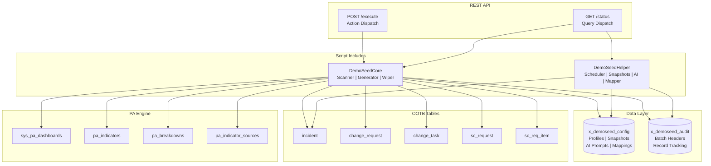

# DemoSeed — ServiceNow Performance Analytics Demo Data Generator

**One-click realistic demo data for Performance Analytics dashboards.**

[](LICENSE)
[](https://www.servicenow.com)
[](tests/test_demoseed.js)

---

## Table of Contents

1. [Overview](#overview)
2. [The Problem](#the-problem)
3. [Architecture](#architecture)
4. [Installation](#installation)
5. [Configuration](#configuration)
6. [API Reference](#api-reference)
7. [ROI Analysis](#roi-analysis)
8. [Troubleshooting](#troubleshooting)
9. [License](#license)

---

## Overview

**DemoSeed** is a ServiceNow scoped application that generates realistic, statistically-distributed synthetic data for Performance Analytics dashboards. Instead of waiting weeks or months for real data to accumulate, DemoSeed populates your PA indicators with believable records in seconds — enabling instant demos, sales presentations, training environments, and proof-of-concept validations.

### Key Features

- **One-Click Generation** — Populate incidents, change requests, catalog items, and change tasks with a single REST call
- **Realistic Distributions** — Weighted priority (P1: 5%, P2: 15%, P3: 50%, P4: 30%), realistic categories, risk levels, and resolution patterns
- **Weekday-Weighted Dates** — More records on weekdays, fewer on weekends — matching real IT operations patterns
- **Data Wiper** — Clean up generated data by batch, date range, or wipe everything. Preview before you delete.
- **Refresh Scheduler** — Daily incremental data generation with auto-aging (old incidents auto-close)
- **Snapshot Manager** — Save and restore demo data states. Export snapshots as XML for sharing.
- **AI-Enhanced Descriptions** — Optional GenAI integration for realistic incident/change descriptions (falls back to curated templates)
- **Field Mapper** — Auto-detect table schemas and suggest generation strategies for custom tables
- **Production Guard** — Cannot accidentally run on production without explicit override
- **Full Audit Trail** — Every generated record is tracked for complete wipe-ability

---

## The Problem

ServiceNow consultants, sales engineers, and platform owners face a recurring challenge: **empty dashboards don't sell**.

Performance Analytics is one of ServiceNow's most powerful features, but it requires historical data to demonstrate value. When you're:

- **Selling ServiceNow** to a prospect with a clean instance
- **Training users** on PA dashboards and need realistic data to explore
- **Building a POC** that needs to show trend lines, not flat zeros
- **Developing PA indicators** and need test data to validate formulas
- **Preparing for a CAB meeting** and need to show what "good" looks like

...you're stuck. Manual data entry is tedious and produces obviously fake patterns. Waiting for real data takes months. Importing production data raises compliance concerns.

**DemoSeed solves this by generating statistically realistic data in seconds**, with distributions that mirror real IT operations — so your dashboards look authentic, your demos impress, and your training is effective.

---

## Architecture



### Data Flow

1. **Profile Creation** — Admin creates a generation profile specifying table targets, volume, and date range
2. **Generation** — `POST /execute { action: "generate" }` triggers the core engine
3. **Dashboard Scanning** — Engine reads PA dashboards, indicators, breakdowns, and source tables
4. **Record Generation** — For each target table, engine creates records with realistic field values using weighted distributions
5. **Audit Trail** — Every record is logged in `x_demoseed_audit` with batch_id, table, and sys_id
6. **PA Population** — Generated records flow into PA indicators automatically (PA runs on schedule)
7. **Cleanup** — Wipe operations remove only tracked records, never touching real data

### Component Details

| Component | Lines | Responsibility |
|-----------|-------|----------------|
| DemoSeedCore | 886 | Dashboard scanner, data generator, distribution profiles, data wiper, audit trail |
| DemoSeedHelper | 548 | Refresh scheduler, snapshot manager, AI description generator, field mapper, quality validator |
| POST /execute | 111 | Action dispatch for 11 operations (generate, wipe, refresh, snapshots, mappings, AI) |
| GET /status | 125 | Query dispatch for 7 query types (batch status, wipe preview, snapshots, profiles, manifest, field suggestions) |

---

## Installation

### Prerequisites

- ServiceNow instance (Utah or later)
- `admin` or `x_demoseed.admin` role
- Performance Analytics plugin activated (`com.snc.pa`)
- (Optional) Generative AI Controller plugin (`com.snc.generative_ai`) for AI features

### Install from Update Set

1. Download the latest update set XML from the [releases page](https://github.com/vladarchitectservicenow-oss/service-catalog-ai-migrator)
2. Navigate to **System Update Sets > Retrieved Update Sets**
3. Click **Import Update Set from XML** and upload the file
4. Load the update set, then **Preview** and **Commit**
5. Verify installation: navigate to **System Applications > Studio** and confirm `DemoSeed` appears

### Post-Installation

1. **Grant roles**: Assign `x_demoseed.admin` to administrators, `x_demoseed.user` to demo users
2. **Configure cross-scope access**: Verify the scoped app has READ/WRITE access to OOTB tables (incident, change_request, etc.)
3. **Set system properties**:
   - `x_demoseed.default_volume` — Default records per table (default: 500)
   - `x_demoseed.default_date_range_days` — Default date range (default: 90)
   - `x_demoseed.ai_enabled` — Enable AI descriptions (default: false)
   - `x_demoseed.override_prod` — Allow on production (default: false — DO NOT enable on production)

---

## Configuration

### Creating a Generation Profile

1. Navigate to `x_demoseed_config.list`
2. Click **New**
3. Fill in:
   - **Name**: e.g., "ITSM Q3 Demo"
   - **Config type**: `profile`
   - **Profile type**: `ITSM`, `CSM`, `HR`, `SecOps`, or `Custom`
   - **Target tables**: JSON array, e.g., `["incident","change_request","change_task"]`
   - **Volume**: Records per table (e.g., 500)
   - **Date range days**: How far back records should span (e.g., 90)
   - **Active**: `true`

### Profile Types

| Type | Default Tables | Use Case |
|------|---------------|----------|
| ITSM | incident, change_request, change_task | Standard IT service management demo |
| CSM | incident, sc_request, sc_req_item | Customer service management demo |
| HR | sc_request, sc_req_item | HR service delivery demo |
| SecOps | incident, change_request | Security operations demo |
| Custom | (user-defined) | Any custom table combination |

### Auto-Stop Profiles

Add `stop:YYYY-MM-DD HH:MM:SS` to the **Description** field to automatically stop a profile's daily refresh after a specific date. Useful for time-limited demos or POCs.

---

## API Reference

### POST /api/x_demoseed/v1/execute

Action-dispatch endpoint. All operations use a single POST endpoint with an `action` body parameter.

**Request:**
```json
{
  "action": "generate",
  "profile_id": "prof001",
  "volume": 500,
  "date_range_days": 90
}
```

**Supported Actions:**

| Action | Parameters | Description |
|--------|-----------|-------------|
| `generate` | profile_id, volume, date_range_days | Generate demo data |
| `wipe_batch` | batch_id | Wipe a specific batch |
| `wipe_range` | start_date, end_date | Wipe by date range |
| `wipe_all` | — | Wipe all DemoSeed data |
| `refresh` | — | Run daily refresh |
| `save_snapshot` | name, description | Save current state |
| `restore_snapshot` | snapshot_id | Restore from snapshot |
| `export_snapshot_xml` | snapshot_id | Export snapshot as XML |
| `apply_field_mappings` | table_name, mappings | Create field mappings |
| `generate_descriptions` | table_name, count | Generate AI/template descriptions |
| `generate_narrative` | dashboard_data | Generate demo narrative |
| `validate_quality` | records | Validate data quality |

**Response (200):**
```json
{
  "batch_id": "abc123-def456",
  "total_records": 1500,
  "tables_processed": ["incident", "change_request", "change_task"],
  "errors": []
}
```

**Error (400):**
```json
{
  "error": "Unknown action: invalid_action",
  "valid_actions": ["generate", "wipe_batch", "..."]
}
```

### GET /api/x_demoseed/v1/status

Query-dispatch endpoint. All queries use a single GET endpoint with query parameters.

**Query Parameters:**

| Parameter | Value | Description |
|-----------|-------|-------------|
| `batch_id` | string | Get batch status |
| `wipe_preview` | true | Preview wipe count |
| `snapshots` | true | List all snapshots |
| `snapshot_id` | string | Get snapshot detail |
| `profiles` | true | List all profiles |
| `manifest` | true | Get dashboard manifest |
| `dashboard_ids` | comma-separated | Filter manifest by dashboards |
| `suggest_mappings` | table_name | Get field mapping suggestions |

**Example:**
```
GET /api/x_demoseed/v1/status?batch_id=abc123&wipe_preview=true
```

---

## ROI Analysis

### Time Savings

| Task | Manual Approach | With DemoSeed | Savings |
|------|----------------|---------------|---------|
| Populate 500 incidents for demo | 4-6 hours (manual entry or script writing) | 30 seconds (one API call) | **99.8%** |
| Create realistic PA dashboard for sales demo | 2-3 days (data entry + PA config) | 5 minutes (generate + PA auto-populates) | **98%** |
| Prepare training environment with 3 months of data | 1-2 weeks (import, clean, anonymize) | 2 minutes (generate with 90-day range) | **99.9%** |
| Wipe and reset demo data between presentations | 30-60 minutes (manual deletion or clone) | 10 seconds (wipe_all) | **99.7%** |
| Build field mappings for custom table | 1-2 hours (inspect schema, write scripts) | 2 minutes (suggestMappings + applyMapping) | **97%** |

### Cost Avoidance

**Scenario: Enterprise ServiceNow Sales Cycle**

A typical enterprise ServiceNow sales cycle involves 5-8 demos, each requiring a fresh instance with realistic data. Without DemoSeed:

- **Instance provisioning**: 2 hours × $150/hr = $300
- **Data population**: 4 hours × $150/hr = $600
- **PA dashboard configuration**: 3 hours × $150/hr = $450
- **Reset between demos**: 1 hour × $150/hr = $150
- **Total per demo cycle**: ~$1,500
- **Annual cost (8 demos)**: **$12,000**

With DemoSeed:

- **Instance provisioning**: 2 hours × $150/hr = $300
- **Data population**: 5 minutes × $150/hr = $12.50
- **PA dashboard configuration**: 30 minutes × $150/hr = $75
- **Reset between demos**: 1 minute × $150/hr = $2.50
- **Total per demo cycle**: ~$390
- **Annual cost (8 demos)**: **$3,120**

**Annual savings: $8,880 per sales team**

**Scenario: ServiceNow Training Program**

A training program with 20 students, each needing their own instance with realistic data:

- **Without DemoSeed**: 20 instances × 6 hours setup = 120 hours = **$18,000**
- **With DemoSeed**: 20 instances × 10 minutes setup = 3.3 hours = **$500**

**Savings per training cohort: $17,500**

### Intangible Benefits

- **Faster sales cycles** — Demos that look real close deals faster
- **Better training outcomes** — Students learn on realistic data, not empty tables
- **Reduced compliance risk** — No need to copy production data to sub-prod instances
- **Improved PA adoption** — Users see value immediately, driving platform stickiness
- **Consultant productivity** — Less time on data prep, more time on value-add configuration

---

## Troubleshooting

### Generation returns 0 records

**Symptom**: `POST /execute` with `action: "generate"` returns `total_records: 0`.

**Causes & Solutions**:

1. **Cross-scope access missing** — The scoped app needs READ/WRITE access to target tables (incident, change_request, etc.). Check **System Applications > Studio > DemoSeed > Cross Scope Access**.
2. **Profile not found** — Verify `profile_id` exists in `x_demoseed_config` with `config_type: "profile"` and `active: "true"`.
3. **Empty target_tables** — If profile's `target_tables` is `[]` or missing, defaults are used. Verify the profile type has valid defaults.
4. **Production guard active** — On production instances, generation is blocked unless `x_demoseed.override_prod` is `true`.

### "Table does not exist" errors

**Symptom**: Error log shows `Table nonexistent_table does not exist`.

**Solution**: The target table name in the profile's `target_tables` JSON array must match the actual table name exactly (case-sensitive). Verify table exists in **System Definition > Tables**.

### AI descriptions not working

**Symptom**: Descriptions are generic templates, not AI-generated.

**Causes & Solutions**:

1. **AI disabled** — Set `x_demoseed.ai_enabled` to `true`.
2. **Plugin not activated** — Activate **Generative AI Controller** (`com.snc.generative_ai`).
3. **No AI prompts configured** — Create config records with `config_type: "ai_prompt"` and names: `description_generator`, `demo_narrative`, `quality_validator`.
4. **BYOK model not configured** — Configure a Bring Your Own Key model in Generative AI Controller settings.

### Wipe operation doesn't remove records

**Symptom**: `wipe_batch` returns `wiped_count: 0`.

**Causes & Solutions**:

1. **Records already wiped** — Check `x_demoseed_audit` for the batch — entries with `wiped: "true"` are already processed.
2. **Records deleted outside DemoSeed** — If records were manually deleted, audit entries still exist but target records don't. This is handled gracefully — wipe skips missing records.
3. **Wrong batch_id** — Verify the batch_id matches the one returned by the `generate` call.

### Snapshot restore produces different data

**Symptom**: Restoring a snapshot produces different record counts than the original generation.

**Explanation**: Snapshots store metadata (profile reference, volume, date range), not individual record data. Restore re-runs generation with the same parameters. Since data is randomly generated, exact records will differ, but volume and distribution will match.

### Performance is slow with large volumes

**Symptom**: Generation of 1000+ records takes more than 30 seconds.

**Solutions**:

1. **Reduce volume** — Start with 100-200 records per table for demos.
2. **Reduce table count** — Generate for fewer tables in a single batch.
3. **Schedule during off-hours** — Use the daily refresh scheduler for large volumes.
4. **Check instance resources** — Sub-production instances may have limited resources.

### Dashboard still shows no data after generation

**Symptom**: Records exist in target tables but PA dashboards show empty.

**Causes & Solutions**:

1. **PA hasn't run yet** — PA indicators update on schedule (typically hourly). Wait for the next PA job run or trigger manually via **PA > Data Collector > Run**.
2. **Date range mismatch** — PA dashboards may filter to "Last 30 days" but generated data spans 90 days. Adjust dashboard filter or generation date range.
3. **Indicator not mapped to table** — Verify the PA indicator's source table matches the table you generated data in.

---

## License

DemoSeed is licensed under the **GNU Affero General Public License v3.0 (AGPL-3.0)**.

Copyright (C) 2026 Vladimir Kapustin

This program is free software: you can redistribute it and/or modify it under the terms of the GNU Affero General Public License as published by the Free Software Foundation, either version 3 of the License, or (at your option) any later version.

This program is distributed in the hope that it will be useful, but WITHOUT ANY WARRANTY; without even the implied warranty of MERCHANTABILITY or FITNESS FOR A PARTICULAR PURPOSE. See the GNU Affero General Public License for more details.

You should have received a copy of the GNU Affero General Public License along with this program. If not, see <https://www.gnu.org/licenses/>.

---

## Contributing

Contributions are welcome. Please open an issue or pull request on the [GitHub repository](https://github.com/vladarchitectservicenow-oss/service-catalog-ai-migrator).

### Development Setup

```bash
# Clone the umbrella repo
git clone https://github.com/vladarchitectservicenow-oss/service-catalog-ai-migrator.git
cd service-catalog-ai-migrator/products/SN_DemoSeed

# Run tests
node tests/test_demoseed.js
```

### Code Standards

- ES5-compatible JavaScript (ServiceNow Rhino engine)
- All GlideRecord `insert()` and `update()` calls wrapped in try/catch
- Copyright header on every source file
- 50 unit tests must pass before any PR

---

## Support

- **Issues**: [GitHub Issues](https://github.com/vladarchitectservicenow-oss/service-catalog-ai-migrator/issues)
- **Documentation**: See `docs/` directory for architecture, dependencies, risks, and test plans
- **ServiceNow Community**: Tag your question with `demoseed`

---

*Built with ❤️ for the ServiceNow community. Make your demos unforgettable.*
